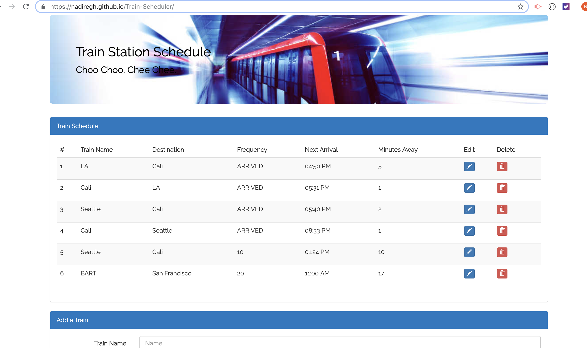

# Train-Scheduler

### I create a train schedule application that incorporates Firebase to host arrival and departure data. Your app will retrieve and manipulate this information with Moment.js. This website will provide up-to-date information about various trains, namely their arrival times and how many minutes remain until they arrive at their station.

* When adding trains, administrators should be able to submit the following:
* Train Name
* Destination 
* First Train Time -- in military time
* Frequency -- in minutes
* I Code this app to calculate when the next train will arrive; this should be relative to the current time.
* Users from many different machines must be able to view same train times.

* I also added update and remove buttons for each train. It will let the user edit the row's elements-- allow them to change a train's Name, Destination and Arrival Time (and then, by relation, minutes to arrival).

### Tools I use :
* HTML
* CSS
* JavaScript
* Bootstrap
* jQuery
* AJAX technique
* GIPHY API

<<<<<<< HEAD

=======

* Use this link to see the deployed site: https://nadiregh.github.io/Train-Scheduler/

>>>>>>> 8ba063be5507a527307876c45cfd319589f0de6d
